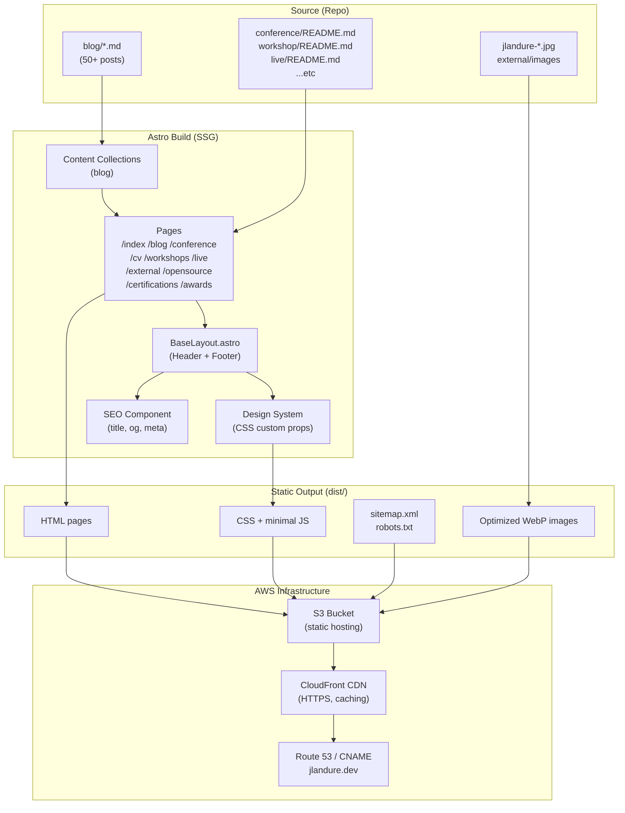
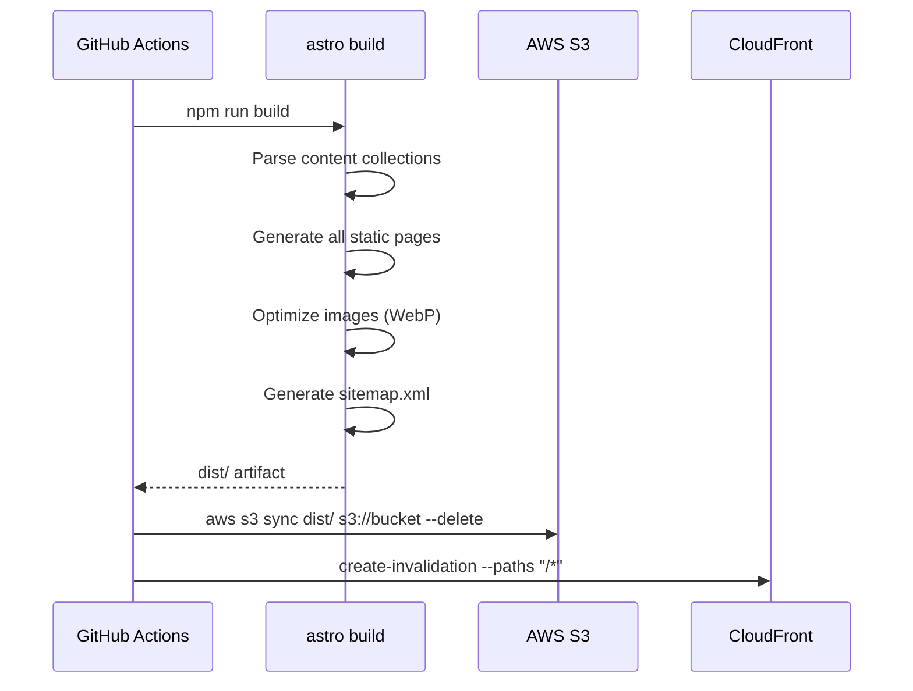

# Design Document: astro-portfolio-website

## Overview

This document describes the technical design for rebuilding Julien Landuré's personal portfolio (jlandure.dev) as a modern static site using the Astro framework. The current Docsify-based site will be replaced with a fully designed, SSG-built Astro site that migrates all existing content (50+ blog posts, bio, certifications, conference talks, CV, external appearances, live sessions, open source contributions, workshops, awards) and deploys to AWS S3 + CloudFront.

The primary goals are:
- Fast, statically generated pages with Lighthouse score ≥ 90
- Modern visual design with dark/light mode, responsive layout (320–1920px)
- Full content migration from existing markdown/README files
- SEO-ready with sitemap, OG tags, and per-page metadata
- AWS deployment with HTTPS, caching, and custom domain preservation

### Key Design Decisions

1. **Astro Content Collections** for blog posts (typed, schema-validated). All other sections (conference, workshop, live, etc.) are parsed from their existing README.md files at build time using custom data loaders or direct markdown rendering — avoiding a full data migration while keeping the source of truth in the existing files.

2. **Single shared Layout component** wrapping all pages, containing the persistent header/nav and footer.

3. **CSS custom properties** for the design system (colors, typography, spacing), toggled via `data-theme` attribute for dark/light mode.

4. **No framework JS** beyond Astro's minimal island hydration — the site is nearly zero-JS for content pages, with islands only for interactive elements (mobile nav toggle, theme switcher).

5. **AWS deployment via GitHub Actions** — `astro build` → `aws s3 sync` → CloudFront invalidation.

---

## Architecture



### Build Pipeline



---

## Components and Interfaces

### Page Structure

```
src/
├── layouts/
│   └── BaseLayout.astro          # Persistent header, footer, SEO slot
├── components/
│   ├── Header.astro              # Nav with active state, mobile toggle
│   ├── Footer.astro              # Social links, domain
│   ├── SEO.astro                 # <title>, <meta>, OG tags
│   ├── ThemeToggle.astro         # Dark/light switcher (island)
│   ├── TagBadge.astro            # Reusable role/type tag pill
│   ├── BlogCard.astro            # Post preview (title, date, excerpt)
│   └── ExpandableDetail.astro    # Collapsible talk description
├── pages/
│   ├── index.astro               # Home / hero + bio + section links
│   ├── blog/
│   │   ├── index.astro           # Paginated blog list
│   │   └── [slug].astro          # Individual post
│   ├── conference.astro          # Grouped by year
│   ├── cv.astro                  # Full CV
│   ├── certifications.astro      # Certifications list
│   ├── workshops.astro           # Grouped by year
│   ├── live.astro                # Music & Sport grouped by year
│   ├── external.astro            # Media appearances
│   ├── opensource.astro          # OSS projects
│   ├── awards.astro              # Awards list
│   └── 404.astro                 # Not found page
├── content/
│   ├── config.ts                 # Content collection schema
│   └── blog/                     # Symlink or copy of blog/*.md
└── styles/
    └── global.css                # Design system CSS custom properties
```

### Component Interfaces

**BaseLayout.astro**
```typescript
interface Props {
  title: string;
  description: string;
  ogImage?: string;
  ogType?: 'website' | 'article';
}
```

**SEO.astro**
```typescript
interface Props {
  title: string;
  description: string;
  ogImage?: string;
  ogType?: 'website' | 'article';
  canonicalUrl?: string;
}
```

**TagBadge.astro**
```typescript
interface Props {
  label: string;
  variant?: 'speaker' | 'organizer' | 'attendee' | 'meetup' |
            'radio' | 'tv' | 'podcast' | 'newspaper' |
            'music' | 'sport' | 'official-trainer' | 'default';
}
```

**BlogCard.astro**
```typescript
interface Props {
  title: string;
  slug: string;
  date: Date;
  excerpt: string;
}
```

**ExpandableDetail.astro**
```typescript
interface Props {
  summary: string;       // The <summary> label (talk title + links)
  content: string;       // Inner HTML of the detail body
}
```

### Navigation Structure

All pages share a persistent header with these links:
`Home | Blog | Conference | CV | Open Source | Workshops | External | Live | Awards`

Active state is determined by matching `Astro.url.pathname` against each route prefix.

---

## Data Models

### Blog Post (Astro Content Collection)

Blog posts live in `src/content/blog/` (sourced from the existing `blog/` directory). The collection schema is defined in `src/content/config.ts`:

```typescript
import { defineCollection, z } from 'astro:content';

const blog = defineCollection({
  type: 'content',
  schema: z.object({
    title: z.string(),
    date: z.coerce.date(),
    excerpt: z.string().optional(),
    // published_in, linkedin etc. are optional metadata
    published_in: z.string().optional(),
    read_time: z.string().optional(),
  }),
});

export const collections = { blog };
```

Since the existing blog markdown files don't have YAML frontmatter (they use a freeform header format), a **remark plugin** will be used to extract the title from the first `# Heading` and the date from the filename (`YYYY-MM-DD-slug.md`). The excerpt will be derived from the first paragraph of body text.

### Conference Entry (Parsed at Build Time)

The `conference/README.md` uses a structured markdown list format with `<span class="detail-tag">` and `<details>` HTML. A custom Astro data loader (`src/lib/parseConference.ts`) will parse this into typed objects:

```typescript
interface ConferenceEntry {
  year: number;
  month: string;
  event: string;
  eventUrl?: string;
  location: string;
  locationFlag: string;
  duration?: string;
  roles: ConferenceRole[];          // ['Speaker', 'Organizer', etc.]
  talkTitle?: string;
  slidesUrl?: string;
  videoUrl?: string;
  description?: string;
  attendees?: number;
  imageUrl?: string;
}

type ConferenceRole = 'Speaker' | 'Organizer' | 'Attendee' | 'Meetup' |
                      'DevFest Organizer' | 'TechReady Organizer' |
                      'Enterprise' | 'Remote' | 'Podcast';
```

### Workshop Entry

```typescript
interface WorkshopEntry {
  year: number;
  month: string;
  title: string;
  language: string;        // flag emoji (🇫🇷 / 🇬🇧)
  location: string;
  duration: string;        // e.g. "1d", "3d"
  attendees: number;
  isOfficialTrainer: boolean;
}
```

### Live Event Entry

```typescript
interface LiveEntry {
  year: number;
  date: string;            // full date string
  event: string;
  eventUrl?: string;
  venue: string;
  location: string;
  locationFlag: string;
  category: 'Music' | 'Sport' | 'Other';
  notes?: string;          // blockquote content (artists, scores)
}
```

### External Appearance Entry

```typescript
interface ExternalEntry {
  date: string;
  title: string;
  type: 'Radio' | 'Television' | 'Podcast' | 'Newspaper' | 'Other';
  directUrl?: string;
  contentPath?: string;    // path to associated .md file
}
```

### Certification Entry

```typescript
interface CertificationEntry {
  issuer: string;          // e.g. "Google Cloud", "AWS"
  name: string;
  badgeUrl?: string;       // Credly or external link
  issuedDate: string;
  notes?: string;          // e.g. "renewal", "Expired"
}
```

### Award Entry

```typescript
interface AwardEntry {
  issuer: string;
  name: string;
  issuedDate: string;
  awardUrl?: string;
  description?: string;    // blockquote content
}
```

### Open Source Entry

```typescript
interface OpenSourceEntry {
  role: 'Creator' | 'Contributor' | 'Maintainer';
  name: string;
  repoUrl: string;
  description: string;
  blogUrl?: string;
  stats: string[];         // e.g. ["1900+ Stars", "20M Downloads"]
}
```

### Design System Tokens

Defined as CSS custom properties in `src/styles/global.css`:

```css
:root {
  /* Colors */
  --color-primary: #4f46e5;       /* indigo-600 */
  --color-primary-hover: #4338ca;
  --color-bg: #ffffff;
  --color-bg-secondary: #f8fafc;
  --color-text: #0f172a;
  --color-text-muted: #64748b;
  --color-border: #e2e8f0;
  --color-tag-bg: #eff6ff;
  --color-tag-text: #1d4ed8;

  /* Typography */
  --font-sans: 'Inter', system-ui, sans-serif;
  --font-mono: 'JetBrains Mono', monospace;
  --text-xs: 0.75rem;
  --text-sm: 0.875rem;
  --text-base: 1rem;
  --text-lg: 1.125rem;
  --text-xl: 1.25rem;
  --text-2xl: 1.5rem;
  --text-4xl: 2.25rem;

  /* Spacing */
  --space-1: 0.25rem;
  --space-2: 0.5rem;
  --space-4: 1rem;
  --space-6: 1.5rem;
  --space-8: 2rem;
  --space-12: 3rem;
  --space-16: 4rem;

  /* Layout */
  --max-width: 1200px;
  --nav-height: 64px;
}

[data-theme="dark"] {
  --color-bg: #0f172a;
  --color-bg-secondary: #1e293b;
  --color-text: #f1f5f9;
  --color-text-muted: #94a3b8;
  --color-border: #334155;
  --color-tag-bg: #1e3a5f;
  --color-tag-text: #93c5fd;
}
```

---

## Correctness Properties

*A property is a characteristic or behavior that should hold true across all valid executions of a system — essentially, a formal statement about what the system should do. Properties serve as the bridge between human-readable specifications and machine-verifiable correctness guarantees.*


### Property 1: Blog posts sorted by date descending

*For any* set of blog posts rendered on the `/blog` list page, the posts must appear in descending date order — the most recently published post first.

**Validates: Requirements 2.2**

### Property 2: Every blog post has a rendered page with content and human-readable date

*For any* markdown file in the `blog/` directory, the static build must produce a corresponding HTML file at `/blog/[slug]/index.html` that contains the post body content and a human-readable date string (not a raw ISO timestamp).

**Validates: Requirements 2.3, 2.6**

### Property 3: Every page has all required meta tags

*For any* HTML file generated in `dist/`, the file must contain a non-empty `<title>`, a `<meta name="description">` tag, and Open Graph tags `og:title`, `og:description`, and `og:image`.

**Validates: Requirements 14.1, 14.2**

### Property 4: sitemap.xml contains a URL for every generated page

*For any* HTML page generated in `dist/` (excluding 404.html), the `sitemap.xml` must contain a `<loc>` entry whose URL corresponds to that page's path.

**Validates: Requirements 14.3**

### Property 5: Every page includes both tracking scripts with correct IDs

*For any* HTML file generated in `dist/`, the file must contain the Umami analytics script referencing website ID `2f1e79be-313e-4f52-891f-c186ab603162` and the Screeb feedback script referencing init ID `02232de0-8346-4185-902e-6c9391ea11f9`.

**Validates: Requirements 16.1, 16.2**

### Property 6: Every page has persistent nav and footer

*For any* HTML file generated in `dist/`, the file must contain a `<nav>` element with links to all required sections (Home, Blog, Conference, CV, Open Source, Workshops, External, Live, Awards) and a `<footer>` element with social links (LinkedIn, GitHub, SpeakerDeck) and the site domain.

**Validates: Requirements 12.1, 12.2**

### Property 7: Active nav state is set correctly per section page

*For any* section page (e.g., `/blog`, `/conference`, `/cv`), the rendered HTML must contain exactly one nav link with an active indicator class, and that link must correspond to the current section.

**Validates: Requirements 12.3**

### Property 8: Conference entries render with all data fields, links, and role tags

*For any* conference entry parsed from `conference/README.md`, the rendered `/conference` page must contain the event name, location, date, and at least one role tag. For entries with slides or video URLs, an `<a>` tag with the correct href must be present. For entries with a description, a `<details>` element must be present.

**Validates: Requirements 5.1, 5.3, 5.4, 5.5**

### Property 9: Workshop entries render with all data fields and Official Trainer distinction

*For any* workshop entry parsed from `workshop/README.md`, the rendered `/workshops` page must contain the training title, location, duration, and attendee count. For entries where `isOfficialTrainer` is true, a distinct "Official Trainer" tag element must be present.

**Validates: Requirements 10.1, 10.3**

### Property 10: Certification entries render with all fields and badge links

*For any* certification entry parsed from `certifications/README.md`, the rendered `/certifications` page must contain the issuer name and issue date. For entries with a badge URL, an `<a>` tag with the correct href must be present.

**Validates: Requirements 4.1, 4.2**

### Property 11: External entries render with correct external link attributes

*For any* external appearance entry parsed from `external/README.md` that has a `directUrl`, the rendered `/external` page must contain an `<a>` tag with `target="_blank"` and `rel` containing `noopener`.

**Validates: Requirements 7.1, 7.3**

### Property 12: CV and certifications page share the same certification data

*For any* certification entry that appears on the `/certifications` page, the same entry (same issuer + name + date) must also appear on the `/cv` page, and vice versa — both pages must render from the same data source with no divergence.

**Validates: Requirements 6.4**

### Property 13: Content collection entries exist for every blog markdown file

*For any* `.md` file in the `blog/` directory (excluding `README.md`), the Astro content collection must expose a corresponding typed entry with a non-empty title and a valid date.

**Validates: Requirements 2.1**

---

## Error Handling

### Build-Time Errors

| Scenario | Handling |
|---|---|
| Blog post missing title (no `# Heading`) | Remark plugin falls back to filename-derived title; build continues |
| Blog post with unparseable date in filename | Build fails with a descriptive error identifying the file |
| Conference/workshop README parse error | Build fails with line number and file path in error message |
| Missing profile photo asset | Astro image optimization throws; build fails with asset path |
| Content collection schema validation failure | Astro throws typed error with field name and expected type |

### Runtime (Static Site) Errors

| Scenario | Handling |
|---|---|
| Visitor navigates to non-existent blog slug | CloudFront returns `404.html` (configured as custom error page) |
| Visitor navigates to any unknown path | CloudFront returns `404.html` |
| Image fails to load | `` has `alt` text; layout does not break |
| Analytics script blocked by ad blocker | Scripts are non-critical; page functions normally without them |

### Data Parsing Defensive Rules

- All parsers must handle missing optional fields gracefully (undefined, not throw)
- All external URLs must be validated as absolute URLs before rendering as `<a>` tags
- Date strings that cannot be parsed fall back to "Unknown date" rather than crashing

---

## Testing Strategy

### Dual Testing Approach

Both unit tests and property-based tests are required. They are complementary:
- Unit tests catch specific regressions and verify concrete examples
- Property tests verify universal invariants across all generated content

### Unit Tests

Focus on specific examples, integration points, and edge cases:

- **Parser unit tests**: Verify that `parseConference.ts`, `parseWorkshop.ts`, etc. correctly parse known fixture inputs (a few representative entries per parser)
- **Component rendering tests**: Verify that `TagBadge.astro` renders the correct CSS class for each variant; `ExpandableDetail.astro` renders `<details>/<summary>`
- **Build smoke test**: Run `astro build` and assert exit code 0 and non-empty `dist/`
- **404 page test**: Assert `dist/404.html` exists
- **robots.txt test**: Assert `dist/robots.txt` contains `Allow: /`
- **Home page test**: Assert `dist/index.html` contains hero section, bio text, profile photo ``, and links to key sections
- **Dark mode test**: Assert global CSS contains `@media (prefers-color-scheme: dark)` or `[data-theme="dark"]` block
- **Font loading test**: Assert CSS contains `font-display: swap`
- **WebP image test**: Assert home page `<picture>` or `` contains a `.webp` source

### Property-Based Tests

Use **fast-check** (TypeScript property-based testing library) for all property tests. Each test must run a minimum of **100 iterations**.

Each property test is tagged with a comment in the format:
`// Feature: astro-portfolio-website, Property {N}: {property_text}`

**P1 — Blog posts sorted by date descending**
```
// Feature: astro-portfolio-website, Property 1: Blog posts sorted by date descending
```
Generate a random subset of blog post entries (from the actual parsed collection). Assert that when sorted by the same logic as the blog index page, the order matches descending date.

**P2 — Every blog post has a rendered page with content and human-readable date**
```
// Feature: astro-portfolio-website, Property 2: Every blog post has a rendered page
```
For each blog post slug in the content collection, assert that `dist/blog/[slug]/index.html` exists, contains non-empty body content, and contains a date string matching a human-readable pattern (e.g., `/\b(January|February|March|April|May|June|July|August|September|October|November|December)\s+\d{1,2},\s+\d{4}\b/`).

**P3 — Every page has all required meta tags**
```
// Feature: astro-portfolio-website, Property 3: Every page has all required meta tags
```
Enumerate all HTML files in `dist/` (excluding 404.html). For each, parse the HTML and assert presence of `<title>`, `<meta name="description">`, `<meta property="og:title">`, `<meta property="og:description">`, `<meta property="og:image">`.

**P4 — sitemap.xml contains a URL for every generated page**
```
// Feature: astro-portfolio-website, Property 4: sitemap.xml contains all page URLs
```
Enumerate all HTML files in `dist/` (excluding 404.html). Parse `dist/sitemap.xml`. For each HTML file, assert a corresponding `<loc>` entry exists in the sitemap.

**P5 — Every page includes both tracking scripts**
```
// Feature: astro-portfolio-website, Property 5: Every page includes both tracking scripts
```
Enumerate all HTML files in `dist/`. For each, assert the HTML contains the Umami script with `data-website-id="2f1e79be-313e-4f52-891f-c186ab603162"` and the Screeb script with the init ID `02232de0-8346-4185-902e-6c9391ea11f9`.

**P6 — Every page has persistent nav and footer**
```
// Feature: astro-portfolio-website, Property 6: Every page has persistent nav and footer
```
Enumerate all HTML files in `dist/`. For each, assert the HTML contains `<nav>` with links to all 9 required sections and `<footer>` with LinkedIn, GitHub, and SpeakerDeck links.

**P7 — Active nav state is set correctly per section page**
```
// Feature: astro-portfolio-website, Property 7: Active nav state is correct per section
```
For each section page (blog, conference, cv, workshops, live, external, opensource, certifications, awards), parse the rendered HTML and assert exactly one nav link has the active class, and that link's href matches the current section path.

**P8 — Conference entries render with all data fields, links, and role tags**
```
// Feature: astro-portfolio-website, Property 8: Conference entries render completely
```
Parse all conference entries from `conference/README.md`. For each entry, assert the rendered `/conference` page HTML contains the event name and at least one role tag element. For entries with slidesUrl/videoUrl, assert an `<a>` with that href. For entries with description, assert a `<details>` element.

**P9 — Workshop entries render with Official Trainer distinction**
```
// Feature: astro-portfolio-website, Property 9: Workshop Official Trainer entries are distinguished
```
Parse all workshop entries. For each entry where `isOfficialTrainer=true`, assert the rendered `/workshops` page HTML contains an "Official Trainer" tag element near that entry.

**P10 — Certification entries render with badge links**
```
// Feature: astro-portfolio-website, Property 10: Certification entries render with badge links
```
Parse all certification entries. For each entry with a `badgeUrl`, assert the rendered `/certifications` page HTML contains an `<a href="[badgeUrl]">`.

**P11 — External entries render with correct external link attributes**
```
// Feature: astro-portfolio-website, Property 11: External links have correct attributes
```
Parse all external entries with a `directUrl`. For each, assert the rendered `/external` page HTML contains an `<a>` with `target="_blank"` and `rel` containing `noopener`.

**P12 — CV and certifications page share the same certification data**
```
// Feature: astro-portfolio-website, Property 12: CV and certifications share data
```
Parse the rendered `/certifications` page and `/cv` page. Assert that every certification entry (identified by issuer + name) present on one page is also present on the other.

**P13 — Content collection entries exist for every blog markdown file**
```
// Feature: astro-portfolio-website, Property 13: Content collection covers all blog files
```
Enumerate all `.md` files in `blog/` (excluding `README.md`). For each, assert the Astro content collection exposes a corresponding entry with a non-empty `title` and a valid `Date` object.

### Test Configuration

- Test runner: **Vitest** (native TypeScript, fast, compatible with Astro)
- Property-based library: **fast-check** (`npm install --save-dev fast-check`)
- Minimum iterations per property test: **100**
- Tests run against the built `dist/` output (post `astro build`)
- CI: property tests run in GitHub Actions after the build step
