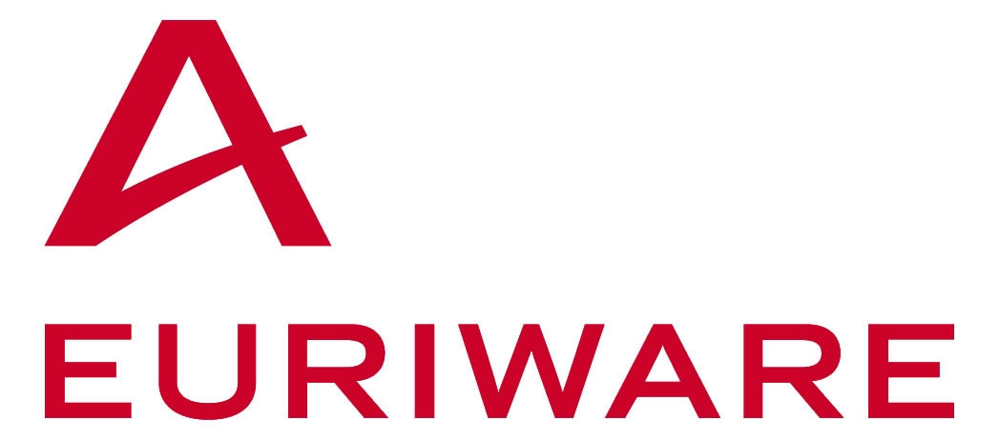

# Euriware

> 2011-10-26 -- [Link](https://fr.wikipedia.org/wiki/Euriware)

# Julien, responsable technique de projet

## Développer ses compétences, assouvir une passion

Titulaire d'un Master professionnel en architecture logicielle, je suis rapidement passé du poste de développeur à celui de responsable technique de projet.
Je suis chargé d'assurer une **veille technologique** et je travaille le plus souvent à la **création d'applications** à partir de technologies opensource.

Pour exemple, je participe depuis deux ans à l'élaboration d'un référentiel collaboratif fondé sur les **technologies Google**, le projet consistant à créer une application de Product Lifecycle Management (PLM)de stockage avec une distribution intelligente des données.

Je collabore également à la réalisation d'architectures techniques et logicielles, notamment celle d'un nouvel outil de Change Management» pour le compte d'un client énergéticien.

Cet outil est destiné à suivre les évolutions de la construction de nouvelles centrales nucléaires en Chine.

Ce qui me stimule dans mes missions,c'est de développer des **solutions spécifiques**, je dois faire preuve de créativité dans mes propositions et rester constamment en **éveil sur le marché** des IT et sur ses avancées.

L'univers des IT, pour moi c'est plus qu'un métier, cela représente une véritable passion ! 

Je suis d'ailleurs fondateur du « Nantes GTUG » le Google Technology User Group de Nantes.

Cette année, j'ai eu la chance de participer à la conférence **Google I/O à San Francisco**, deux journées durant lesquelles le géant du Web a présenté ses dernières innovations et où j'ai pu échanger avec des développeurs du monde entier.

A mon retour, j'ai pu partager cette expérience avec mes collègues d'Euriware lors des «Jeudis de l'innovation et de la technologie» des séances internes d'information et d'échanges sur les nouveautés IT.

# Article Google I/O 2011

> 25 Juillet 2011

# Article GTUG

> 29 Novembre 2011

