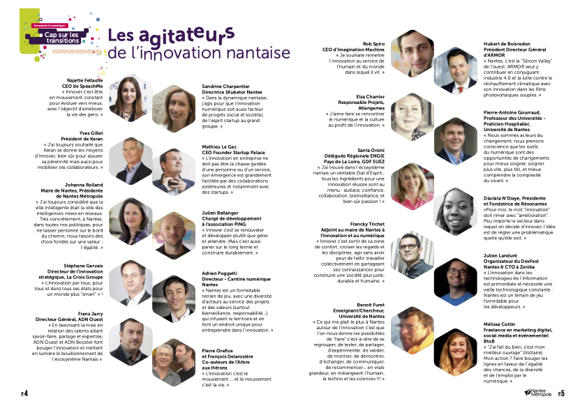

# Nantes Métropole

> 2018-08 -- [Original Link](https://twitter.com/franckytrichet/status/1065669138767626242) -- [Fichier PDF complet](./2018-08-gdg-innovation-nm-smart-city-plaquette.pdf ':ignore')

## Les agitateurs de l’innovation nantaise

### Julien Landuré

Organisateur du DevFest Nantes & CTO à Zenika
> « L’innovation dans les technologies de l’information est primordiale et nécessite une veille technologique constante : Nantes est un terrain de jeu formidable pour les développeurs. »

]