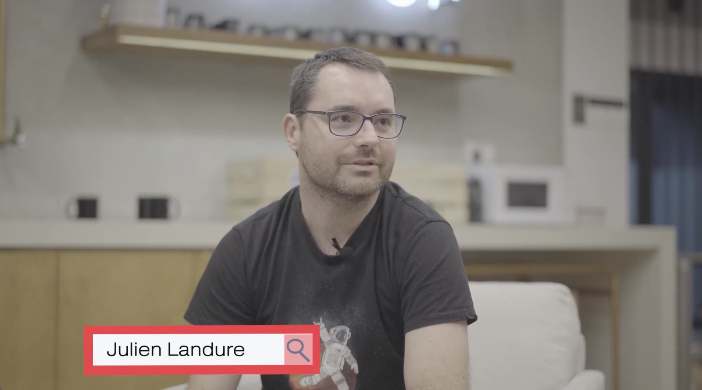

# FACES OF W ANDREY: Julien Landure. 

## How to market yourself as a developer

> [Full video with the interview](https://youtu.be/pxq9e697BpI)

Julien Landure is a chief technology officer Zenika Nantes, Organizer GDG Nantes, and DevFest / GDE Google Cloud Platform. He is sharing his experience as a CTO and as a non-profit organizer. How he is distributing the time between multiple roles through communication, organizing conference and coding. At Zenika culture transparency is one of the values, where developers can access almost all information of the company by sharing, communicating and showing their achievements within the Zenika community. Julien also sharing how he has started The DevFest conference and built the non-profit community with the support of Google, inviting speakers from other parts of the world. Julien giving advice to juniors and how to market yourself as a developer.

- [00:43](https://www.youtube.com/watch?v=pxq9e697BpI&list=PLdVDu8iO6zrMurVwGrFR23uw5OtGh4vFx&index=8&t=43s) Day to day work experience as a CTO 
- [01:16](https://www.youtube.com/watch?v=pxq9e697BpI&list=PLdVDu8iO6zrMurVwGrFR23uw5OtGh4vFx&index=8&t=76s) Distributing the time between multiple roles 
- [02:08](https://www.youtube.com/watch?v=pxq9e697BpI&list=PLdVDu8iO6zrMurVwGrFR23uw5OtGh4vFx&index=8&t=128s) Communication is an important part within and outside the company 
- [04:44](https://www.youtube.com/watch?v=pxq9e697BpI&list=PLdVDu8iO6zrMurVwGrFR23uw5OtGh4vFx&index=8&t=284s) How to market yourself as a developer 
- [06:25](https://www.youtube.com/watch?v=pxq9e697BpI&list=PLdVDu8iO6zrMurVwGrFR23uw5OtGh4vFx&index=8&t=385s) Before joining Zenika Group, previous experience 
- [08:23](https://www.youtube.com/watch?v=pxq9e697BpI&list=PLdVDu8iO6zrMurVwGrFR23uw5OtGh4vFx&index=8&t=503s) Involvement with Google Developer Group Nantes 
- [09:59](https://www.youtube.com/watch?v=pxq9e697BpI&list=PLdVDu8iO6zrMurVwGrFR23uw5OtGh4vFx&index=8&t=599s) How to organize the IT conference such as The DevFest 
- [14:30](https://www.youtube.com/watch?v=pxq9e697BpI&list=PLdVDu8iO6zrMurVwGrFR23uw5OtGh4vFx&index=8&t=870s) The diversity of The DevFest conference
- [15:34](https://www.youtube.com/watch?v=pxq9e697BpI&list=PLdVDu8iO6zrMurVwGrFR23uw5OtGh4vFx&index=8&t=934s) Zenika culture, transparency is the value 
- [16:22](https://www.youtube.com/watch?v=pxq9e697BpI&list=PLdVDu8iO6zrMurVwGrFR23uw5OtGh4vFx&index=8&t=982s) Advise for junior developers from CTO 
- [17:20](https://www.youtube.com/watch?v=pxq9e697BpI&list=PLdVDu8iO6zrMurVwGrFR23uw5OtGh4vFx&index=8&t=1040s) Focus on one or two technologies at the beginning 
- [18:38](https://www.youtube.com/watch?v=pxq9e697BpI&list=PLdVDu8iO6zrMurVwGrFR23uw5OtGh4vFx&index=8&t=1118s) How important to be a fast learner in technology 
- [19:39](https://www.youtube.com/watch?v=pxq9e697BpI&list=PLdVDu8iO6zrMurVwGrFR23uw5OtGh4vFx&index=8&t=1179s) Managing time between CTO Nantes and CTO group 
- [20:49](https://www.youtube.com/watch?v=pxq9e697BpI&list=PLdVDu8iO6zrMurVwGrFR23uw5OtGh4vFx&index=8&t=1249s) Credits
