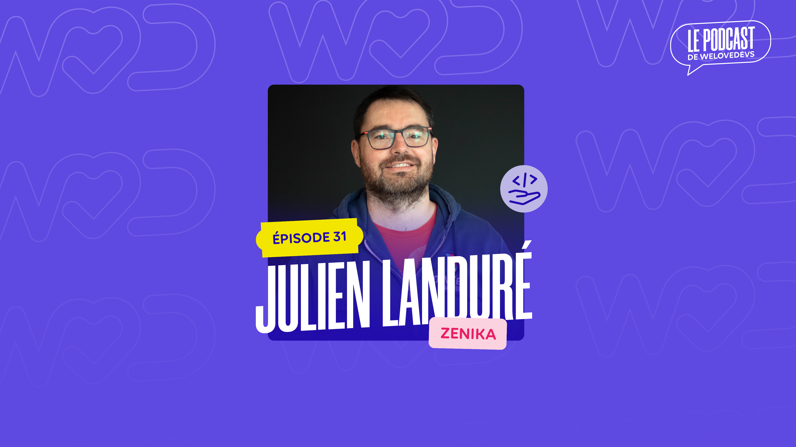

# WeLoveDevs

> 2022-04-05 -- [Original Link](https://welovedevs.com/fr/articles/31-julien-landure-zenika/)

> #31 – Julien Landuré – CTO chez Zenika – Être curieux, apprendre et partager

### Être curieux, apprendre et partager

Julien Landuré est le CTO des CTO chez ZENIKA.

Alors vous vous demanderez ce que c’est un CTO dans une société de service. Et ce podcast y répondra en détail. Pour faire simple, son job est d’aider les techs chez Zénika à se construire un projet de carrière. Et il le fait avec des personnes qui sont des experts nationaux et plus encore. Pour cela, ils utilisent un framework de carrière développé, sur 6 branches.Vous pouvez retrouver le détail et les visuels sur [leur blog juste ici](https://blog.zenika.com/2021/11/08/parcours-de-carrieres-career-paths-career-crafting-consultants/) 👋

Il y avait autre chose que je voulais découvrir au travers de cet enregistrement. Les Z consultants sont reconnaissables, ils aiment être ensemble et ils sont de plus en plus nombreux. C’est qu’ils partagent une conviction en commun, un jeu de valeur ou un projet. Et ce n’est pas écrit sur les murs, ce n’est pas écrit sur le site web. C’est incarné par chacun des Z consultants.

Il y a un premier truc, c’est une forme de carpe diem. Ils sont toujours avenants, de bonne humeur. Tout se passe toujours bien. J’avais aussi la sensation qu’ils vivent intensément leurs passions. Et ça Julien Landuré nous l’explique. Il le répète comme un mantra : « Être curieux, apprendre et partager ». Je pense qu’il le répète et le mets en application tous les jours depuis 10 ans et c’est très inspirant.

Merci beaucoup Julien 🙏

<iframe width="560" height="315" src="https://www.youtube.com/embed/fM_02gK2me0" title="YouTube video player" frameborder="0" allow="accelerometer; autoplay; clipboard-write; encrypted-media; gyroscope; picture-in-picture" allowfullscreen></iframe>